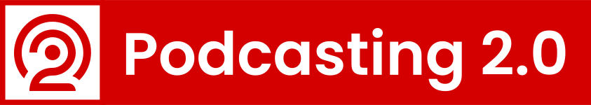

# The "podcast" Namespace

A wholistic rss namespace for podcasting that is meant to synthesize the fragmented world of podcast namespaces. The 
broad goal is to create a single, compact, efficient namespace that is easily extensible, community 
controlled/authored and addresses the needs of the independent podcast industry now and in the future. Our hope is 
that this namespace will become the framework that the independent podcast community needs to deliver new 
functionality to apps and aggregators.

Our guiding principles for development of this namespace are the
"[Rules for Standards Makers](http://scripting.com/2017/05/09/rulesForStandardsmakers.html)" by Dave Winer. Please 
read it before contributing if you aren't familiar with it.

The podcast namespace is part of the larger "Podcasting 2.0" project which exists to bring control of podcasting's 
protocols back into the hands of the open podcasting community.  A good overview can be found here:  
[Podcasting 2.0](podcasting2.0.md)

* [Official XMLNS Definition](docs/1.0.md) the official definition of all formalized tags.
* List of platforms and apps that currently implement some or all of these 
  tags: [Supporting Platforms and Apps](docs/element-support.md).
* Example Feed: There is an example feed [example.xml](example.xml) in this repository showing the podcastindex 
  namespace side by side with the Apple itunes namespace. * [Other recommendations](docs/other-recommendations.md) 
  when creating RSS podcast feeds.

  

## Current Roadmap

**Phase 1** - [Closed] Comment period closed on `11/15/2020` and [5 tags](#phase-1-closed-on-111520) were 
**formalized**.

**Phase 2** - [Closed] Comment period closed on `1/31/2021` and [4 tags](#phase-2-closed-on-13121) were **formalized**.

**Phase 3** - [Closed] Comment period closed on `6/1/2021` and [5 tags](#phase-3-closed-on-6121) were **formalized**.

**Phase 4** - [Closed] Comment period closed on `12/1/2021` and [3 tags](#phase-4-closed-on-1212021) were 
**formalized**.

**Phase 5** - [Closed] Comment period closed on `7/15/2022` and [2 tags](#phase-5-closed-as-of-7152022) were 
**formalized**.

**Phase 6** - [Closed] Comment period closed on `6/1/2023` and [6 tags](#phase-6-closed-as-of-612023) were 
**formalized**. 

  

## Legend

**Formalized** - This tag is frozen and listed in the XMLNS document.  Any future changes to it's definition must 
maintain backwards compatibility.

**Finalized** - The tag is structurally stable and implementation testing should be considered safe.  Any breaking 
changes will be widely communicated.

**Open** - The tag/phase is open for discussion and collaboration.

**Required** - This tag or attribute must be present.

**Optional** - This tag or attribute may be left out.

**Recommended** - This tag or attribute is technically optional, but is strongly recommended to be present for the 
tag to function as fully intended.

  

## Tag Adoption Process

To be adopted as an official part of the namespace, there must be consensus around a tag's usefulness and either 
commitment to adoption by at least 1 host and 1 app, or a recognition that the tag is already being used in the wild.

It is ALWAYS ok to delay a tag to a future Phase if there is any concern about it.  That is to be expected and 
encouraged.

When a Phase comes to a close, there will be a full review of any tags currently open for comment and questions will 
be asked to gather consensus before final adoption.  No tags will be adopted by fiat, or if there are unresolved 
questions.  They will just be moved to the next Phase for further comment and refinement.

Tags that are proposals or rough ideas should be expected to have syntax problems or typos.  Those should be refined 
away as they are worked on.  If they are not, that is a good idea that the tag in question isn't being seen as 
useful and should be considered for dropping.

We are not a "standards body".  It is a community driven project where all stake holders are encouraged to 
participate, so that many voices are heard.  This is an open-source project to be built fully in the open.  
Discussions also take place on [podcastindex.social](https://podcastindex.social) where anyone is free to register 
and participate.

  

### Goal #1 - Eliminate Redundancy

There is significant overlap amongst the many existing podcast namespaces.  Each platform and publisher has created 
their own namespace to give their respective system and audience the metadata they need in the way they want it 
delivered.

### Goal #2 - Keep "required" tags and attributes minimal

The only required tags should be those that solve an overwhelming need in the industry.  Requiring tags is a 
roadblock to adoption and should be avoided.  Attributes should also only be required when they are key to the 
functionality of the tag.

### Goal #3 - Keep Exisiting Conventions

Reinventing the wheel helps nobody.  When at all possible, existing conventions should be maintained.  For example, 
it would make sense to turn **\<podcast:explicit>** into a unary element, where it's existence is taken as a "yes" 
and it's absence as a "no".  But, that has never been the standard.  And, given as how this namespace will probably 
sit alongside at least one other namespace, it makes sense to keep existing conventions in place.

### Goal #4 - Be General... to a point

There is no way to address every possible metadata point that each platform would want.  That is not the aim.  
Instead we focus on defining the elements that would be useful to the broadest set of apps, publishers, platforms 
and aggregators.  Individual parties can keep their respective supplemental namespaces small and targeted as an 
adjunct to this larger namespace.  But, we don't want to be so general that the spec becomes overly complicated.  A 
beautiful, "perfect" spec is not important.  Solving real problems is.

  

## Copying information

The "podcast" namespace is [dedicated to the public domain using CC0 v1.0](COPYING.txt) so as to remove all barriers 
to adoption, development and contribution.

  

## Element List

### <u>Phase 1 (Closed on 11/15/20)</u>

 

The following tags have been formally adopted into the namespace.  They are fully documented in the XMLNS document 
located [here](docs/1.0.md).  Please see that file for full implementation details.

- **\<podcast:locked>**  
- **\<podcast:transcript>**  
- **\<podcast:funding>**  
- **\<podcast:chapters>**  
- **\<podcast:soundbite>**  

 

### <u>Phase 2 (Closed on 1/31/21)</u>

 

The following tags have been formally adopted into the namespace.  They are fully documented in the XMLNS document 
located [here](docs/1.0.md).  Please see that file for full implementation details.

- **\<podcast:person>**  
- **\<podcast:location>**  
- **\<podcast:season>**  
- **\<podcast:episode>**  

 

### <u>Phase 3 (Closed on 6/1/21)</u>

 

The following tags have been formally adopted into the namespace.  They are fully documented in the XMLNS document 
located [here](docs/1.0.md).  Please see that file for full implementation details.

- **\<podcast:trailer>**  
- **\<podcast:license>**  
- **\<podcast:alternateEnclosure>**  
  - **\<podcast:source>**  
  - **\<podcast:integrity>**  
- **\<podcast:guid>**  

 

## <u>Phase 4 (Closed on 12/1/2021)</u>

 

The following tags have been formally adopted into the namespace.  They are fully documented in the XMLNS document 
located [here](docs/1.0.md).  Please see that file for full implementation details.

- **\<podcast:medium>**  
- **\<podcast:images>**  
- **\<podcast:liveItem>**  

 

## <u>Phase 5 (Closed as of 7/15/2022)</u>

 

The following tags have been formally adopted into the namespace.  They are fully documented in the XMLNS document 
located [here](docs/1.0.md).  Please see that file for full implementation details.

- **\<podcast:socialInteract>**  
- **\<podcast:block>**  

 

## <u>Phase 6 (Closed as of 6/1/2023)</u>

The following tags have been formally adopted into the namespace.  They are fully documented in the XMLNS document 
located [here](docs/1.0.md).  Please see that file for full implementation details.

- **\<podcast:txt>**  
- **\<podcast:remoteItem>**  
- **\<podcast:podroll>**  
- **\<podcast:updateFrequency>**  
- **\<podcast:podping>**  
- **\<podcast:valueTimeSplit>**  

 

## Other Proposals

A list of the current proposed tags can be found in the issues
section [here](https://github.com/Podcastindex-org/podcast-namespace/labels/proposal).

  

## Branding

[Podcasting2.org](https://podcasting2.org)

[Podcasting 2.0 Brand Guide](https://live.standards.site/podcasting20/)

