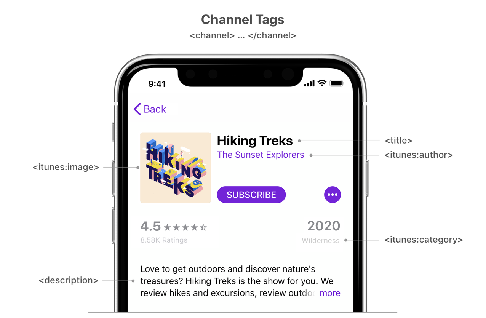
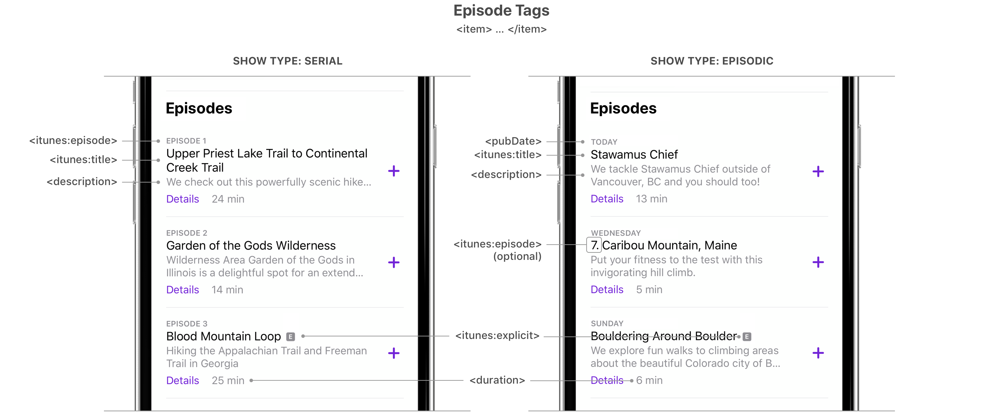

# iTunes Namespace Reference Helper

Official:  [iTunes Namespace Reference](https://help.apple.com/itc/podcasts_connect/#/itcb54353390)

## Channel

- `<itunes:title>`
- `<itunes:image>`
- `<itunes:category>`
- `<itunes:explicit>`
- `<itunes:author>`
- `<itunes:type>`
- `<itunes:new-feed-url>`
- `<itunes:block>`
- `<itunes:complete>`

## Episode

- `<itunes:title>`
- `<itunes:image>`
- `<itunes:explicit>`
- `<itunes:duration>`
- `<itunes:episode>`
- `<itunes:season>`
- `<itunes:episodeType>`
- `<itunes:block>`


<br><br>

# A Podcaster's Guide to RSS
<small>Archived from the [original](https://help.apple.com/itc/podcasts_connect/#/itcb54353390) in case of future link
breakage.</small>

<br>

An RSS feed contains all the metadata of a podcast. This information governs what listeners will see about your podcast
on Apple’s services: from the the show art, to whether a podcast shows up in relevant searches, to episode titles and
descriptions.

In order for a podcast to be listed on Apple’s podcast directory and show up within the Apple Podcasts app, a
corresponding RSS feed must be created, submitted on Podcasts Connect, and it must pass Apple’s validation (see
Podcaster Support for more information).

All metadata in an RSS feed is stored within element tags (here is a RSS Feed Sample for reference). Each tag is
applicable to either show data (contained within the <channel> tag) or episode data (contained within an <item> tag).
This guide will explain what data to include and how it should be structured.

Note: This page does not list all supported RSS tags, just the most important ones. If Apple deprecates RSS tags in the
future, podcasters will receive notifications in Podcasts Connect and newsletter.

The figure below depicts a “Show view” from the Apple Podcasts app, and and labels how <channel> tags map to show
information.


In the table below, Required tags must be present in your RSS feed or it won’t pass validation to be listed in Apple
Podcasts. Recommended tags aren’t required but are highly encouraged because they provide useful information to users.
Situational tags are important in certain circumstances.

<div class="table-wrapper"><table data-type="Multicolumn" aria-label="RSS show tags for Podcasts Connect"><thead><tr><th colspan="3" scope="col"><p class="TableHead">Show tags</p></th><th colspan="6" scope="col"><p class="TableHead">Usage</p></th><th colspan="3" scope="col"><p class="TableHead">Parent tag</p></th></tr></thead><tbody><tr><td colspan="3"><p><strong>Required tags</strong></p></td><td colspan="6"></td><td colspan="3"></td></tr><tr><td colspan="3"><p>&lt;title&gt;</p></td><td colspan="6"><p>The show title.</p><p>It’s important to have a clear, concise name for your podcast. Make your title specific. A show titled <em>Our Community Bulletin</em> is too vague to attract many subscribers, no matter how compelling the content.</p><p>Pay close attention to the title as Apple&nbsp;Podcasts uses this field for search.</p><p>If you include a long list of keywords in an attempt to game podcast search, your show may be removed from the Apple directory.</p></td><td colspan="3"><p><code>&lt;channel&gt;</code></p></td></tr><tr><td colspan="3"><p>&lt;description&gt;</p></td><td colspan="6"><p>The show description.</p><p>Where <code>description</code> is text containing one or more sentences describing your podcast to potential listeners. The maximum amount of text allowed for this tag is 4000 bytes.</p><p>To include links in your description or rich HTML, adhere to the following technical guidelines: enclose all portions of your XML that contain embedded HTML in a CDATA section to prevent formatting issues, and to ensure proper link functionality. For example:</p><div class="CodeLines"><code class="CodeLine">  &lt;![CDATA[</code><code class="CodeLine">    &lt;a href="http://www.apple.com"&gt;Apple&lt;/a&gt;</code><code class="CodeLine">  ]]&gt;</code></div></td><td colspan="3"><p><code>&lt;channel&gt;</code></p></td></tr><tr><td colspan="3"><p>&lt;itunes:image&gt;</p></td><td colspan="6"><p>The artwork for the show.</p><p>Specify your show artwork by providing a URL linking to it.</p><p>Depending on their device, subscribers see your podcast artwork in varying sizes. Therefore, make sure your design is effective at both its original size and at thumbnail size. You should include a show title, brand, or source name as part of your podcast artwork. Here are additional <a href="https://podcasters.apple.com" class="URL" target="_blank">marketing best practices</a>. For examples of podcast artwork, see the Top Podcasts chart. To avoid technical issues when you update your podcast artwork, be sure to:</p><ul><li><p>Change the artwork file name and URL at the same time</p></li><li><p>Verify the web server hosting your artwork allows HTTP head&nbsp;requests</p></li></ul><p>Artwork must be a minimum size of 1400&nbsp;x&nbsp;1400 pixels and a maximum size of 3000 x 3000 pixels, in JPEG or PNG format, 72 dpi, with appropriate file extensions (.jpg, .png), and in the RGB colorspace. These requirements are different from the standard RSS image tag specifications.</p><p>Make sure the file type in the URL matches the actual file type of the image file.</p></td><td colspan="3"><p><code>&lt;channel&gt;</code></p></td></tr><tr><td colspan="3"><p>&lt;language&gt;</p></td><td colspan="6"><p>The language spoken on the show.</p><p>Because Apple&nbsp;Podcasts is available in territories around the world, it is critical to specify the language of a podcast. Apple&nbsp;Podcasts only supports values from the <a href="http://www.loc.gov/standards/iso639-2/php/code_list.php" class="URL" target="_blank">ISO 639</a> list (two-letter language codes, with some possible modifiers, such as "en-us").</p><p>Invalid language codes will cause your feed to fail Apple validation.</p></td><td colspan="3"><p><code>&lt;channel&gt;</code></p></td></tr><tr><td colspan="3"><p>&lt;itunes:category&gt;</p></td><td colspan="6"><p>The show category information. For a complete list of categories and subcategories, see <a href="https://podcasters.apple.com/support/1691-apple-podcasts-categories" class="URL" target="_blank">Apple Podcast categories</a>.</p><p>Select the category that best reflects the content of your show. If available, you can also define a subcategory.</p><p>Although you can specify more than one category and subcategory in your RSS feed, Apple Podcasts only recognizes the first category and subcategory.</p><p>When specifying categories and subcategories, be sure to properly escape ampersands. For example:</p><p>Single category:</p><div class="CodeLines"><code class="CodeLine">  &lt;itunes:category text="History" /&gt;</code></div><p>Category with ampersand:</p><div class="CodeLines"><code class="CodeLine">  &lt;itunes:category text="Kids &amp;amp; Family" /&gt;</code></div><p>Category with subcategory:</p><div class="CodeLines"><code class="CodeLine">  &lt;itunes:category text="Society &amp;amp; Culture"&gt;</code><code class="CodeLine">    &lt;itunes:category text="Documentary" /&gt;</code><code class="CodeLine">  &lt;/itunes:category&gt;</code></div><p>Multiple categories:</p><div class="CodeLines"><code class="CodeLine">  &lt;itunes:category text="Society &amp;amp; Culture"&gt;</code><code class="CodeLine">    &lt;itunes:category text="Documentary" /&gt;</code><code class="CodeLine">  &lt;/itunes:category&gt;</code><code class="CodeLine">  &lt;itunes:category text="Health"&gt;</code><code class="CodeLine">    &lt;itunes:category text="Mental Health" /&gt;</code><code class="CodeLine">  &lt;/itunes:category&gt;</code></div></td><td colspan="3"><p><code>&lt;channel&gt;</code></p></td></tr><tr><td colspan="3"><p>&lt;itunes:explicit&gt;</p></td><td colspan="6"><p>The podcast parental advisory information.</p><p>The explicit value can be one of the following:</p><ul><li><p><strong>True</strong>. If you specify <code>true</code>, indicating the presence of explicit content, Apple&nbsp;Podcasts displays an <a href="#/itcfafb6d665" class="xRef Aside" aside="itcfafb6d665">Explicit</a> parental advisory graphic for your podcast.</p><p>Podcasts containing explicit material aren’t available in some Apple&nbsp;Podcasts territories.</p></li><li><p><strong>False</strong>. If you specify <code>false</code>, indicating that your podcast doesn’t contain explicit language or adult content, Apple&nbsp;Podcasts displays a <a href="#/itcb343e8058" class="xRef Aside" aside="itcb343e8058">Clean</a> parental advisory graphic for your podcast.</p></li></ul></td><td colspan="3"><p><code>&lt;channel&gt;</code></p></td></tr><tr><td colspan="3"><p><strong>Recommended tags</strong></p></td><td colspan="6"></td><td colspan="3"></td></tr><tr><td colspan="3"><p>&lt;itunes:author&gt;</p></td><td colspan="6"><p>The group responsible for creating the show.</p><p>Show author most often refers to the parent company or network of a podcast, but it can also be used to identify the host(s) if none exists.</p><p>Author information is especially useful if a company or organization publishes multiple podcasts.</p></td><td colspan="3"><p><code>&lt;channel&gt;</code></p></td></tr><tr><td colspan="3"><p>&lt;link&gt;</p></td><td colspan="6"><p>The website associated with a podcast.</p><p>Typically a home page for a podcast or a dedicated portion of a larger website. For example:</p><div class="CodeLines"><code class="CodeLine">&lt;link&gt;</code><code class="CodeLine"> http://www.mypodcast.com</code><code class="CodeLine">&lt;/link&gt;</code></div><p>or</p><div class="CodeLines"><code class="CodeLine">&lt;link&gt;</code><code class="CodeLine"> http://www.mediacompany.com/podcast</code><code class="CodeLine">&lt;/link&gt;</code></div></td><td colspan="3"><p><code>&lt;channel&gt;</code></p></td></tr><tr><td colspan="3"><p><strong>Situational tags</strong></p></td><td colspan="6"></td><td colspan="3"></td></tr><tr><td colspan="3"><p>&lt;itunes:title&gt;</p></td><td colspan="6"><p>The show title specific for Apple Podcasts.</p><p><code>&lt;itunes:title</code>&gt; is a string containing a clear concise name of your show on Apple Podcasts.</p></td><td colspan="3"><p><code>&lt;channel&gt;</code></p></td></tr><tr><td colspan="3"><p>&lt;itunes:type&gt;</p></td><td colspan="6"><p>The type of show.</p><p>If your show is Serial you must use this tag.</p><p>Its values can be one of the following:</p><ul><li><p><strong>Episodic</strong> (default). Specify <em>episodic</em> when episodes are intended to be consumed without any specific order. Apple Podcasts will present newest episodes first and display the publish date (required) of each episode. If organized into <a href="#/itc77382b700" class="xRef Aside" aside="itc77382b700">seasons</a>, the newest season will be presented first - otherwise, episodes will be grouped by year published, newest first.</p><p>For new subscribers, Apple&nbsp;Podcasts adds the newest, most recent episode in their Library.</p></li><li><p><strong>Serial</strong>. Specify <em>serial</em> when episodes are intended to be consumed in sequential order. Apple Podcasts will present the oldest episodes first and display the episode numbers (required) of each episode. If organized into seasons, the newest season will be presented first and  <code>&lt;itunes:episode&gt;</code> numbers must be given for each episode.</p><p>For new subscribers, Apple&nbsp;Podcasts adds the first episode to their Library, or the entire current season if using seasons.</p></li></ul></td><td colspan="3"><p><code>&lt;channel&gt;</code></p></td></tr><tr><td colspan="3"><p>&lt;copyright&gt;</p></td><td colspan="6"><p>The show copyright details.</p><p>If your show is copyrighted you should use this tag. For example:</p><div class="CodeLines"><code class="CodeLine">&lt;copyright&gt;Copyright 1995-2019 John John Appleseed&lt;/copyright&gt;</code></div></td><td colspan="3"><p><code>&lt;channel&gt;</code></p></td></tr><tr><td colspan="3"><p>&lt;itunes:new-feed-url&gt;</p></td><td colspan="6"><p>The new podcast RSS Feed URL.</p><p>If you change the URL of your podcast feed, you should use this tag in your new feed.</p><p>Use the <code>&lt;itunes:new-feed-url&gt;</code> tag to manually change the URL where your podcast is located.</p><div class="CodeLines"><code class="CodeLine">&lt;itunes:new-feed-url&gt;</code><code class="CodeLine">  https://newlocation.com/example.rss</code><code class="CodeLine">&lt;/itunes:new-feed-url&gt;</code></div><p>You should maintain your old feed until you have migrated your existing subscribers. Learn how to <a href="https://podcasters.apple.com/support/change-the-rss-feed-url" class="URL" target="_blank">update your podcast RSS feed URL</a>.</p><div class="Alert"><p class="Note"><em>Note: </em>The <code>&lt;itunes:new-feed-url&gt;</code> tag reports new feed URLs to Apple&nbsp;Podcasts and isn’t displayed in Apple&nbsp;Podcasts.</p></div></td><td colspan="3"><p><code>&lt;channel&gt;</code></p></td></tr><tr><td colspan="3"><p>&lt;itunes:block&gt;</p></td><td colspan="6"><p>The podcast show or hide status.</p><p>If you want your show removed from the Apple directory, use this tag.</p><p>Specifying the <code>&lt;itunes:block&gt;</code> tag with a <code>Yes</code> value, prevents the entire podcast from appearing in Apple&nbsp;Podcasts.</p><p>Specifying any value other than <code>Yes</code> has no effect.</p></td><td colspan="3"><p><code>&lt;channel&gt;</code></p></td></tr><tr><td colspan="3"><p>&lt;itunes:complete&gt;</p></td><td colspan="6"><p>The podcast update status.</p><p>If you will never publish another episode to your show, use this tag.</p><p>Specifying the <code>&lt;itunes:complete&gt;</code> tag with a <code>Yes</code> value indicates that a podcast is complete and you will not post any more episodes in the&nbsp;future.</p><p>Specifying any value other than <code>Yes</code> has no effect.</p></td><td colspan="3"><p><code>&lt;channel&gt;</code></p></td></tr></tbody></table></div>

The figure below depicts a “Show view” from the Apple Podcasts app and labels how <item> tags map to episode
information. It’s important to note that the `<itunes:type>` show tag listed above affects how episodes are displayed.

By default shows are categorized as episodic meaning the most recent episodes will show up first and the <pubDate> of an
episode will be displayed. If you specify your show `<itunes:type>` to be serial, which requires also
specifying `<itunes:episode>` numbers for each episode, then episodes will be listed oldest to newest.



In the table below, Required tags must be present in your RSS feed or it won’t pass validation to be listed in Apple
Podcasts. Recommended tags aren’t required but are highly encouraged because they provide useful information to users.
Situational tags are important in certain circumstances.

<div class="table-wrapper"><table data-type="Multicolumn" aria-label="RSS episode tags for Podcasts Connect"><thead><tr><th colspan="3" scope="col"><p class="TableHead">Episode tags</p></th><th colspan="6" scope="col"><p class="TableHead">Usage</p></th><th colspan="3" scope="col"><p class="TableHead">Parent tag</p></th></tr></thead><tbody><tr><td colspan="3"><p><strong>Required tags</strong></p></td><td colspan="6"></td><td colspan="3"></td></tr><tr><td colspan="3"><p>&lt;title&gt;</p></td><td colspan="6"><p>An episode title.</p><p><code>title</code> is a string containing a clear, concise name for your episode.</p><p>Don’t specify the episode number or season number in this tag. Instead, specify those details in the appropriate tags ( <code>&lt;itunes:episode&gt;</code>, <code>&lt;itunes:season&gt;</code>). Also, don’t repeat the title of your show within your episode title.</p><p>Separating episode and season number from the title makes it possible for Apple to easily index and order content from all shows.</p></td><td colspan="3"><p><code>&lt;item&gt;</code></p></td></tr><tr><td colspan="3"><p>&lt;enclosure&gt;</p></td><td colspan="6"><p>The episode content, file size, and file type information.</p><p>The <code>&lt;enclosure&gt;</code> tag has three attributes: URL, length, and type:</p><ul><li><p><strong>URL</strong>. The URL attribute points to your podcast media file. The file extension specified within the URL attribute determines whether or not content appears in the podcast directory. Supported file formats include M4A, MP3, MOV, MP4, M4V, and PDF.</p></li><li><p><strong>Length</strong>. The length attribute is the file size in bytes. You can find this information in the properties of your podcast file (on a Mac, choose File &gt; Get Info and refer to the size&nbsp;field).</p></li><li><p><strong>Type</strong>. The type attribute provides the correct category for the type of file you are using. The type values for the supported file formats are: audio/x-m4a, audio/mpeg, video/quicktime, video/mp4, video/x-m4v, and application/pdf.</p></li></ul><p>For example:</p><div class="CodeLines"><code class="CodeLine">&lt;enclosure</code><code class="CodeLine"> url="http://mypodcast.com/episode001.mp3" </code><code class="CodeLine"> length="5650889"</code><code class="CodeLine"> type="audio/mpeg</code><code class="CodeLine">/&gt;</code></div></td><td colspan="3"><p><code>&lt;item&gt;</code></p></td></tr><tr><td colspan="3"><p><strong>Recommended tags</strong></p></td><td colspan="6"></td><td colspan="3"></td></tr><tr><td colspan="3"><p>&lt;guid&gt;</p></td><td colspan="6"><p>The episode’s globally unique identifier (<a href="https://cyber.harvard.edu/rss/rss.html#ltguidgtSubelementOfLtitemgt" class="URL" target="_blank">GUID</a>) If you uploaded subscriber audio in Apple Podcasts Connect and need to link it to an episode in your RSS feed, you can use the Apple Podcasts Episode ID in the GUID tag. Learn more about <a href="https://podcasters.apple.com/support/set-up-your-show-for-a-subscription" class="URL" target="_blank">how to set up your show for a subscription</a>.</p><p>It is very important that each episode have a unique GUID and that it never changes, even if an episode’s metadata, like title or enclosure URL, do change.</p><p><a href="#/itc5e66a7048" class="xRef Aside" aside="itc5e66a7048">Globally unique identifiers (GUID)</a> are case-sensitive strings. If a GUID is not provided, an episode’s enclosure URL will be used instead. If a GUID is not provided, make sure that an episode’s enclosure URL is unique and never changes.</p><p>Failing to comply with these guidelines may result in duplicate episodes being shown to listeners, inaccurate data in <a href="https://help.apple.com/itc/podcastsanalytics/" class="URL" target="_blank">Analytics</a>, and can cause issues with your podcasts’s listing and chart placement in Apple Podcasts.</p></td><td colspan="3"><p><code>&lt;item&gt;</code></p></td></tr><tr><td colspan="3"><p>&lt;pubDate&gt;</p></td><td colspan="6"><p>The date and time when an episode was released.</p><p>Format the date using the <a href="http://www.faqs.org/rfcs/rfc2822.html" class="URL" target="_blank">RFC&nbsp;2822</a> specifications. For example: <code>Wed, 15 Jun 2019 19:00:00 GMT</code>.</p></td><td colspan="3"><p><code>&lt;item&gt;</code></p></td></tr><tr><td colspan="3"><p>&lt;description&gt;</p></td><td colspan="6"><p>An episode description.</p><p><code>description</code> is text containing one or more sentences describing your episode to potential listeners. You can specify up to 4000 bytes. You can use rich text formatting and some HTML (<code>&lt;p&gt;</code>, <code>&lt;ol&gt;</code>, <code>&lt;ul&gt;</code>, <code>&lt;li&gt;</code>, <code>&lt;a&gt;</code>) if wrapped in the <code>&lt;CDATA&gt;</code> tag.</p><p>To include links in your description or rich HTML, adhere to the following technical guidelines: enclose all portions of your XML that contain embedded HTML in a CDATA section to prevent formatting issues, and to ensure proper link functionality. For example:</p><div class="CodeLines"><code class="CodeLine">  &lt;![CDATA[</code><code class="CodeLine">    &lt;a href="http://www.apple.com"&gt;Apple&lt;/a&gt;</code><code class="CodeLine">  ]]&gt;</code></div></td><td colspan="3"><p><code>&lt;item&gt;</code></p></td></tr><tr><td colspan="3"><p>&lt;itunes:duration&gt;</p></td><td colspan="6"><p>The duration of an episode.</p><p>Different duration formats are accepted however it is recommended to convert the length of the episode into seconds.</p></td><td colspan="3"><p><code>&lt;item&gt;</code></p></td></tr><tr><td colspan="3"><p>&lt;link&gt;</p></td><td colspan="6"><p>An episode link URL.</p><p>This is used when an episode has a corresponding webpage. For example:</p><div class="CodeLines"><code class="CodeLine">&lt;link&gt;</code><code class="CodeLine"> http://www.mypodcast.com/episode-one.html</code><code class="CodeLine">&lt;/link&gt;</code></div></td><td colspan="3"><p><code>&lt;item&gt;</code></p></td></tr><tr><td colspan="3"><p>&lt;itunes:image&gt;</p></td><td colspan="6"><p>The episode artwork.</p><p>You should use this tag when you have a high quality, episode-specific image you would like listeners to see.</p><p>Specify your episode artwork using the <code>href</code>&nbsp;attribute in the <code>&lt;itunes:image&gt;</code> tag. <a id="ember469" class="ember-view xRef AppleTopic" href="#/itcbaf351599">RSS Feed Sample</a>.</p><p>Depending on their device, listeners see your episode artwork in varying sizes. Therefore, make sure your design is effective at both its original size and at thumbnail size. You should include a title, brand, or source name as part of your episode artwork. To avoid technical issues when you update your episode artwork, be sure to:</p><ul><li><p>Change the artwork file name and URL at the same time</p></li><li><p>Verify the web server hosting your artwork allows HTTP head&nbsp;requests</p></li></ul><p>Artwork must be a minimum size of 1400&nbsp;x&nbsp;1400 pixels and a maximum size of 3000 x 3000 pixels, in JPEG or PNG format, 72 dpi, with appropriate file extensions (.jpg, .png), and in the RGB colorspace. These requirements are different from the standard RSS image tag specifications.</p><p>Make sure the file type in the URL matches the actual file type of the image file.</p></td><td colspan="3"><p><code>&lt;item&gt;</code></p></td></tr><tr><td colspan="3"><p>&lt;itunes:explicit&gt;</p></td><td colspan="6"><p>The episode parental advisory information.</p><p>Where the explicit value can be one of the following:</p><ul><li><p><strong>true</strong>. If you specify <code>true</code>, indicating the presence of explicit content, Apple&nbsp;Podcasts displays an <a href="#/itcfafb6d665" class="xRef Aside" aside="itcfafb6d665">Explicit</a> parental advisory graphic for your episode.</p><p>Episodes containing explicit material aren’t available in some Apple&nbsp;Podcasts territories.</p></li><li><p><strong>false</strong>. If you specify <code>false</code>, indicating that the episode does not contain explicit language or adult content, Apple&nbsp;Podcasts displays a <a href="#/itcb343e8058" class="xRef Aside" aside="itcb343e8058">Clean</a> parental advisory graphic for your episode.</p></li></ul></td><td colspan="3"><p><code>&lt;item&gt;</code></p></td></tr><tr><td colspan="3"><p><strong>Situational tags</strong></p></td><td colspan="6"></td><td colspan="3"></td></tr><tr><td colspan="3"><p>&lt;itunes:title&gt;</p></td><td colspan="6"><p>An episode title specific for Apple Podcasts.</p><p><code>&lt;itunes:title&gt;</code> is a string containing a clear concise name of your episode on Apple Podcasts.</p><p>Don’t specify the episode number or season number in this tag. Instead, specify those details in the appropriate tags ( <code>&lt;itunes:episode&gt;</code>, <code>&lt;itunes:season&gt;</code>). Also, don’t repeat the title of your show within your episode title.</p><p>Separating episode and season number from the title makes it possible for Apple to easily index and order content from all shows.</p></td><td colspan="3"><p><code>&lt;item&gt;</code></p></td></tr><tr><td colspan="3"><p>&lt;itunes:episode&gt;</p></td><td colspan="6"><p>An episode number.</p><p>If all your episodes have numbers and you would like them to be ordered based on them, use this tag for each one.</p><p>Episode numbers are optional for <code>&lt;itunes:type&gt;</code><em>episodic</em> shows, but are mandatory for <em>serial</em> shows.</p><p>Where <code>episode</code> is a non-zero integer (1, 2, 3, etc.) representing your episode number.</p><p>If you are using your RSS feed to distribute a free version of an episode that is already available to Apple Podcasts paid subscribers, make sure the episode numbers are the same so you don’t have duplicate episodes appear on your show page. Learn more about how to <a href="https://podcasters.apple.com/support/set-up-your-show-for-a-subscription" class="URL" target="_blank">set up your show for a subscription</a>.</p></td><td colspan="3"><p><code>&lt;item&gt;</code></p></td></tr><tr><td colspan="3"><p>&lt;itunes:season&gt;</p></td><td colspan="6"><p>The episode season number.</p><p>If an episode is within a season use this tag.</p><p>Where <code>season</code> is a non-zero integer (1, 2, 3, etc.) representing your season number.</p><p>To allow the season feature for shows containing a single season, if only one season exists in the RSS feed, Apple&nbsp;Podcasts doesn’t display a season number. When you add a second season to the RSS feed, Apple&nbsp;Podcasts displays the season numbers.</p></td><td colspan="3"><p><code>&lt;item&gt;</code></p></td></tr><tr><td colspan="3"><p>&lt;itunes:episodeType&gt;</p></td><td colspan="6"><p>The episode type.</p><p>If an episode is a trailer or bonus content, use this tag.</p><p>Where the episodeType value can be one of the following:</p><ul><li><p><strong>Full</strong> (default). Specify full when you are submitting the complete content of your <a href="#/itca5dea085b" class="xRef Aside" aside="itca5dea085b">show</a>.</p></li><li><p><strong>Trailer</strong>. Specify trailer when you are submitting a short, promotional piece of content that represents a preview of your current show.</p></li><li><p><strong>Bonus</strong>. Specify bonus when you are submitting extra content for your show (for example, behind the scenes information or interviews with the cast) or cross-promotional content for another show.</p></li></ul><p>The rules for using trailer and bonus tags depend on whether the <code>&lt;itunes:season&gt;</code> and <code>&lt;itunes:episode&gt;</code> tags have values:</p><p><strong>Trailer:</strong></p><ul><li><p>No season or episode number: a show trailer</p></li><li><p>A season number and no episode number: a season trailer. (<em>Note</em>: an episode trailer should have a different <code>&lt;guid&gt;</code> than the actual episode)</p></li><li><p>Episode number and optionally a season number: an  episode trailer/teaser, later replaced with the actual episode</p></li></ul><p><strong>Bonus:</strong></p><ul><li><p>No season or episode number: a show bonus</p></li><li><p>A season number: a season bonus</p></li><li><p>Episode number and optionally a season number: a bonus episode related to a specific episode</p></li></ul></td><td colspan="3"><p><code>&lt;item&gt;</code></p></td></tr><tr><td colspan="3"><p>&lt;itunes:block&gt;</p></td><td colspan="6"><p>The episode show or hide status.</p><p>If you want an episode removed from the Apple directory, use this tag.</p><p>Specifying the <code>&lt;itunes:block&gt;</code> tag with a <code>Yes</code> value prevents that episode from appearing in Apple&nbsp;Podcasts.</p><p>For example, you might want to block a specific episode if you know that its content would otherwise cause the entire podcast to be removed from Apple&nbsp;Podcasts.</p><p>Specifying any value other than <code>Yes</code> has no effect.</p></td><td colspan="3"><p><code>&lt;item&gt;</code></p></td></tr></tbody></table></div>

Here are few more technical details on using RSS with Apple Podcasts:

Apple Podcasts accepts RSS 2.0 tags as well as some additional tags specific to Apple Podcasts.

When you use tags specific to Apple Podcasts, indicated by a leading <itunes:> prefix, you must add the following
namespace declaration as the second line in your XML:

```xml
<rss xmlns:itunes="http://www.itunes.com/dtds/podcast-1.0.dtd" version="2.0">
```

Without this declaration, Podcasts Connect ignores all tags specific to Apple Podcasts. The namespace definition is case
sensitive, and must be entered as shown.

Use plain text UTF-8 encoding for your feed. Tag values are limited to 255 characters unless otherwise specified above.
Don’t add leading or trailing spaces to your values.